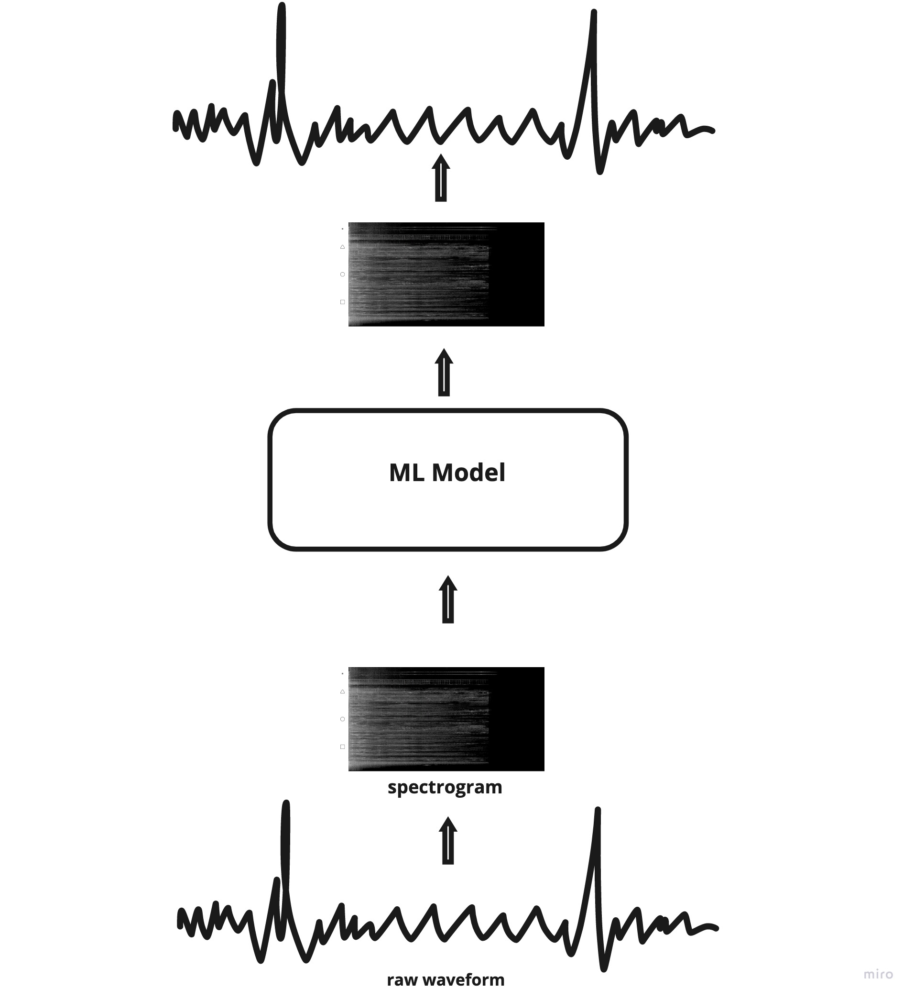
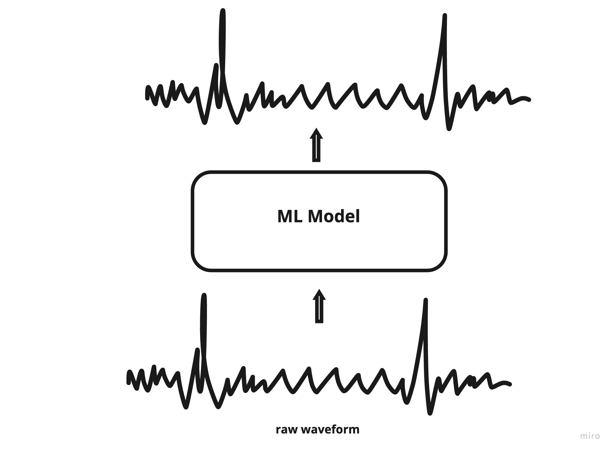

# A complete guide to speech enhancement 

Speech enhancement refers to techniques that aim to reduce distortions and to improve one or more perceptual speech qualities. The enhanced speech is expected to be of superior quality with minimal or no noise in it. It is also knows an audio enhancement, denoiser and noise reduction. 

## Applications

Speech enhancement has wide applications including improving the quality of audio processing systems like speech recognition. Several past experiments have shown that this preprocessing has led to improved speech recognition. It is also used in other applications such as hearing aids, VoIP, etc. 

## Techniques 
Methods to implement speech enhancement can be broadly classified into traditional statistical methods and modern deep neural network-based methods.

### Traditional methods

Traditional methods for speech enhancement focus on removing the noise from the speech using statistical techniques. There are two types of noise that you should know

- **Stationary noise**: The statistical properties of this type of noise do not change with time. For example, gaussian noise.
- **Non-stationary noise**: The statistical properties of this type of noise change with time. For example, traffic.


### Spectral subtraction

Spectral subtraction is one the very popular traditional approach towards speech enhancement. In this method, it is assumed that noise in speech is completely uncorrelated with clean speech. 


*Noisy Speech = Clean speech + Addictive noise*

The noise spectrum is estimated during speech pauses, which is then subtracted from the noisy speech spectrum to obtain a clean speech spectrum. Short-term Fourier transform representation is given by,

$$ 
Y(w,k) = S(w,k) + N(w,k) 
$$
Where k is the frame number. Now, the magnitude spectrum of clean speech can be estimated as

$$ 
|S(w,k)^2 | = |Y(w,k)^2|  - | \hat N(w,k)^2 |
$$

$ \hat N(w,k)^2 $ is the estimated noisy spectrum which is defined as,

$$
| \hat N(w,k)^2| = 1/M \sum_{i=0}^m |Y_S(w)|^2 
$$

Where M is the consecutive number of speech pauses. 


There are different variants of spectral subtraction,

- **Spectral over-subtraction**: Two additional parameters are introduced the in spectral subtraction method to reduce the remnant noise.
- **Multi-band spectral subtraction** : In this algorithm, the speech spectrum is divided into uniformly spaced frequency bands and spectral subtraction is done individually on each band. 
- **Winer filter** : Wiener filter focus on minimizing the mean squared error between clean speech and estimated clean speech. Wiener filter can be applied in both the time and frequency domains. There is a requirement to estimate the power spectral density of clean speech and noisy speech prior to filtering and hence non-causal WF cannot to applied directly to estimate clean speech. An adaptive WF can be estimated as,
	
$$
H_w(k) = {|Y(k)|^2 - | \hat D(k)|^2 \over  | \hat D(k)|^2}
$$
$$
|C(k)|^2  = H_w(k) * |Y(k)|^2	
$$

Here $H_w(k)$ is the estimated WF. A clean speech spectrum can be obtained by multiplying WF with the original noisy speech spectrum. 

#### Spectral gating
A noise gate is a mechanism used to attenuate signals below a threshold. Spectral gating is a form of noise gating. A spectrogram is calculated for the given signal and optional noise signal. A threshold for noise gating is estimated from the spectrogram for each frequency band. This threshold is then used to estimate a mask which is then used to filter noise from the given signal. 

Spectral gating is used as the underlying principle in the popular open-source noise removal python package [Noisereduce](https://github.com/timsainb/noisereduce). It provides implementations for both stationary and non-stationary noise reduction. 
	
### Deep learning based methods

Deep learning based speech enhancement models can be categorized based on the type of input feature and model architecture. 

Based on the type of input feature,

- **waveform features**: Audio data is high dimensional. One second of audio sampled at 16KHz contains 16000 samples. Traditional Deep neural networks cannot be used to model this type of data as DNNs will fail to capture any information from data due to the same reason. To tackle this issue, different feature extraction methods are used to extract features from audio data. Some of the very popular ones are Short term Fourier transform(STFT)  and Mel frequency cepstral coefficients (MFCC). 



- **Raw waveform**: Due to the advancement of deep learning in recent years, deep learning models capable of directly processing audio data without any external feature engineering have been proposed and have yielded astounding results. These models are designed to process high dimensional data and model temporal dependencies efficiently. 



Based on architecture, 

- **Denoising autoencoder (DAE)**: This was one of the earliest DNN-based approaches toward speech enhancement that resulted in superior performance compared to traditional methods. The notion behind using DAE is that noise is considered to be redundant information when trying to map from noisy speech to clean speech. DAEs can be comprised of fully connected networks, convolution networks, and recurrent neural networks. .

- **Generative adversarial networks (GAN)**: GANs are one of the latest advancements in the field of deep learning. It assumes that the training data is generated using an unknown distribution and tries to efficiently estimate that distribution. A GAN is a combination of two network components, the generator, and the discriminator. Some of the very recent speech enhancement methods use this technique. 

Popular Deep learning-based architectures


- [**Deep Denoising Autoencoder**](): This is a DAE based architecture. Mel frequency power spectrum (MFP) of the speech segment is used as input to the denoising autoencoder. The restored MFP output from the decoder is transformed back into the time domain to yield the denoised speech data. The TensorFlow implementation of this paper can be found [here](https://github.com/jonlu0602/DeepDenoisingAutoencoder). 

- [**DCCRN**](): This is a convolution based encoder-decoder network, LSTMs are also used before the decoder to model the temporal dependencies. Complex convolution and RNN are introduced to consider both the magnitude and phase of the input waveform. PyTorch implementation can be found [here](https://github.com/shahules786/mayavoz/blob/main/mayavoz/models/dccrn.py).

- [**Wave-U Net**](): This architecture directly models the raw waveform. It is a DAE based architecture that uses 1D convolutions and skip-connections. Pytorch implementation can be found [here](https://github.com/shahules786/mayavoz/blob/main/mayavoz/models/waveunet.py).

- [**DEMUCS**](): is a waveform-to-waveform model with a U-net structure and bidirectional LSTM.  It is an encoder-decoder architecture composed of a convolution encoder, decoder, and bidirectional LSTM.  Pytorch implementation can be found [here](https://github.com/santi-pdp/segan_pytorch).

- [**SEGAN**](): This architecture operates on a waveform level and uses generative adversarial networks for speech enhancement. Pytorch implementation can be found [here](https://github.com/santi-pdp/segan_pytorch).


### Evaluation methods

When it comes to the evaluation of audio machine learning models that outputs audio, it is broadly classified into
Objective metrics: metrics that are based on standard formulas, these can be calculated given predicted audio and target audio. 
Subjective metrics: metrics that are based on human interpretation of the output quality. Some of the common objective metrics used to measure audio enhancement are, 

- **Mean absolute error (MSE)**: the absolute difference between predicted and target waveform. Also, a popular loss function while training DNN.
- **Mean squared error (MSE)**: mean of the squared difference between the predicted waveform and target waveform. Also used as a popular loss function while training DNNs.   
- **Root mean squared error ( RMSE)**: square root of the mean of the squared difference between the predicted waveform and target waveform. Also used as a popular loss function while training DNNs.   
- **Scale invariant signal-to-distortion ratio (SI-SDR)**: slightly modified and robust signal-to-noise ratio proposed in the paper [SDR - half baked or well done?](https://arxiv.org/pdf/1811.02508.pdf)
- **Short-term objective intelligibility (STOI)**:  an objective intelligibility measure for speech enhancement. 
- **Perceptual evaluation of speech quality (PESQ)**

The most popular subjective evaluation metric for audio is the **Mean opinion score (MOS)**. It is expressed on a scale of 1 to 5 where 5 is the best.

### Popular open datasets

- **Valentini dataset**: Clean and noisy parallel speech database. The database was designed to train and test speech enhancement methods that operate at 48kHz. The noises used to create noisy speech were taken from DEMAND. See more details [here](https://datashare.ed.ac.uk/handle/10283/2791).

- **Microsoft Scalable Noisy Speech Dataset (MS-SNSD)**:  This dataset is a large collection of clean speech and a variety of environmental noise. This can be combined using the provided script to create a speech enhancement dataset. See more details [here](https://github.com/microsoft/MS-SNSD).

- **Deep noise suppression challenge(DNS)**: The DNS challenge is designed to improve the capabilities of deep learning in speech denoising. The challenge is organized every year starting in 2020. See more details [here](https://github.com/microsoft/DNS-Challenge).

### Mayavoz

It is PyTorch based speech enhancement toolkit designed for audio ML practitioners and researchers. It provides half a dozen pretrained models that one can use without any hassle. 

```python
from mayavoz.models import Mayamodel

model = Mayamodel.from_pretrained("shahules786/mayavoz-waveunet-valentini-28spk")
model.enhance("noisy_audio.wav")
```

It also facilitates highly customizable custom model training for SE.  You can select and set the desired architecture, dataset and loss function and Mayavoz will take care of rest!  Checkout mayavoz [here](https://github.com/shahules786/mayavoz). 

